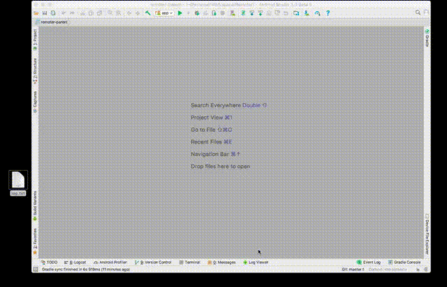
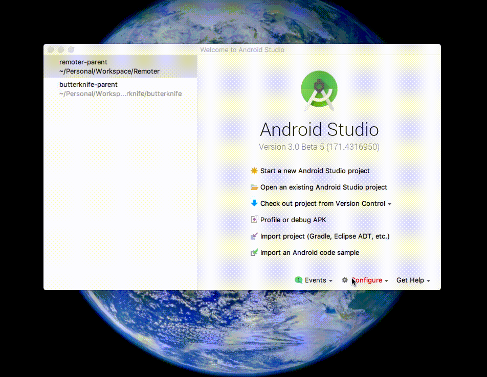

# Log Viewer

**Log Viewer** is Android Studio plugin with better log viewing capability.

**Features :**

* Easily filter on **multiple process**
* Add **possitive** and **negative** text filters
	* Start a filter with "-" to set a negative filter
	* This will remove the logs containing that filter from the set of logs that matches the rest of possitive filters
* **Pause** and **resume** live logs
* **Share** log **privately** with one click.
* Avoid clutter by **folding** logs from top, bottom or selection
* **Drag** and **drop** log files
* Switch between multiple log sources including devices and files
* Works **also** on **non android** projects

Getting Log Viewer
--------

* Open Android Studio Preferences/Settings
* Go to Plugins
* Select "Browse Repositories"
* Search for "Log Viewer" and install

License
-------

    Copyright 2017 Joseph Samuel

    Licensed under the Apache License, Version 2.0 (the "License");
    you may not use this file except in compliance with the License.
    You may obtain a copy of the License at

       http://www.apache.org/licenses/LICENSE-2.0

    Unless required by applicable law or agreed to in writing, software
    distributed under the License is distributed on an "AS IS" BASIS,
    WITHOUT WARRANTIES OR CONDITIONS OF ANY KIND, either express or implied.
    See the License for the specific language governing permissions and
    limitations under the License.

